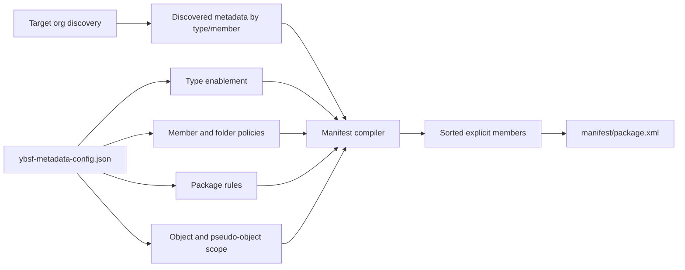

# Manifest Generation

`ybsf generate-manifest` builds `manifest/package.xml` by starting with metadata discovered from the target org and then filtering that discovered set through the rules in `ybsf-metadata-config.json`.

## Command
```bash
ybsf generate-manifest --config ybsf-metadata-config.json --target-org <org-alias> [--output manifest/package.xml]
```

For full command help, run `ybsf generate-manifest --help` or `ybsf help generate-manifest`.

## Inputs
- `ybsf-metadata-config.json`
- target org metadata discovery
- optional package inclusion settings from `packageRules`

## Output
- `manifest/package.xml`
- with `--debug`, an `excludedPackage.xml` artifact showing discovered metadata that the config filtered out

## How The Filtering Works


## Main Filtering Stages
1. Discover metadata available in the target org.
2. Keep only metadata types where `enabled=true`.
3. Apply `memberPolicy` or `folderPolicy` for each enabled type.
4. Apply managed-package and unlocked-package rules from `packageRules`.
5. Apply object-scope rules so child metadata only survives when its parent object scope is in range.
6. Write a sorted `package.xml` with explicit members only.

## What To Tune In The Config
- `metadataTypes[].enabled`
- `metadataTypes[].memberPolicy`
- `metadataTypes[].folderPolicy`
- `packageRules.includeManagedPackages`
- `packageRules.includeUnlockedPackages`
- `packageRules.namespaces`
- `processingRules.includePseudoObjects`

## Example
Generate the default manifest for an org:
```bash
ybsf generate-manifest --target-org <org-alias>
```

Write the manifest somewhere else while reviewing results:
```bash
ybsf generate-manifest --target-org <org-alias> --output tmp/package.xml
```

## `--debug` Troubleshooting
Add `--debug` to keep discovery and manifest-compilation artifacts under `tmp/`.

Example:
```bash
ybsf generate-manifest --target-org <org-alias> --debug
```

Typical run directory:
```text
tmp/
└── ybsf-generate-manifest-2026-03-10T14-28-44-002Z/
    ├── debug.json
    ├── excludedPackage.xml
    ├── org-discovery/
    │   └── package.xml
    ├── project-generate-manifest.cmd.txt
    ├── project-generate-manifest.stdout.txt
    ├── project-generate-manifest.stderr.txt
    ├── project-generate-manifest.status.json
    └── org-list-metadata-*.{cmd,stdout,stderr,status}.txt/json
```

Useful files to inspect:
- `debug.json`: discovered members, selected members, excluded members, warnings, and object-scope filtering counts
- `excludedPackage.xml`: discovered metadata filtered out by config
- `org-discovery/package.xml`: raw discovery manifest generated from the target org
- `*.cmd.txt`, `*.stdout.txt`, `*.stderr.txt`, `*.status.json`: exact `sf` invocations and results for discovery fallbacks

## Related Docs
- Choosing tracked metadata: [selecting-tracked-metadata.md](selecting-tracked-metadata.md)
- Retrieve process: [retrieve-process.md](retrieve-process.md)
- Technical specs:
  - [specs/runtime-command-spec.md](specs/runtime-command-spec.md)
  - [specs/manifest-generation-spec.md](specs/manifest-generation-spec.md)
